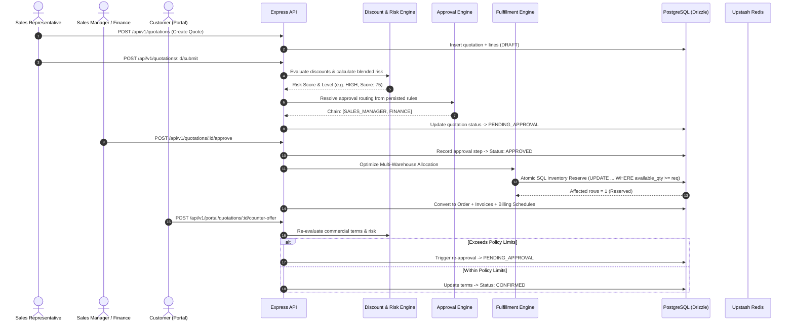
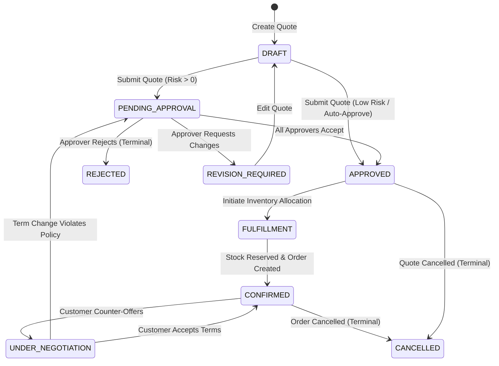
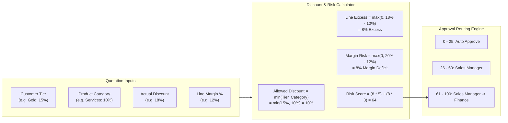
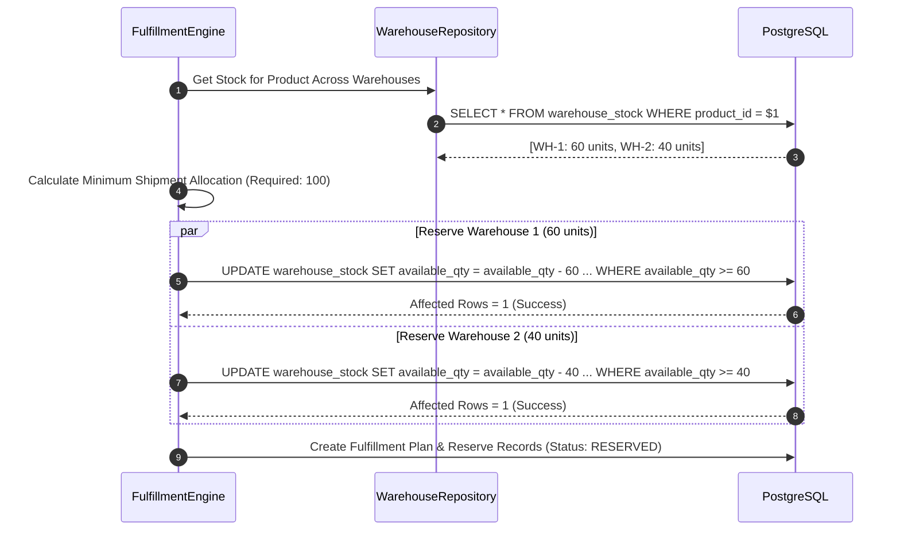
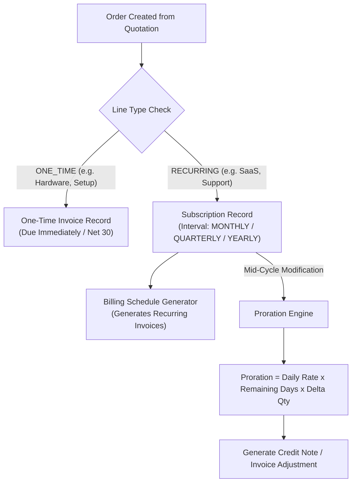
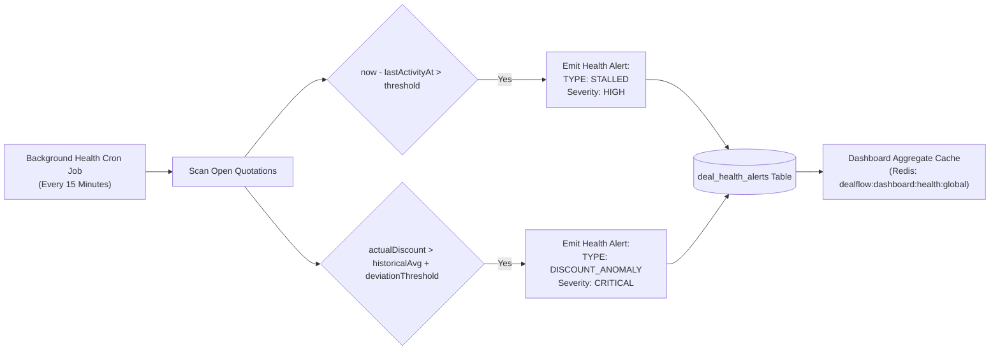
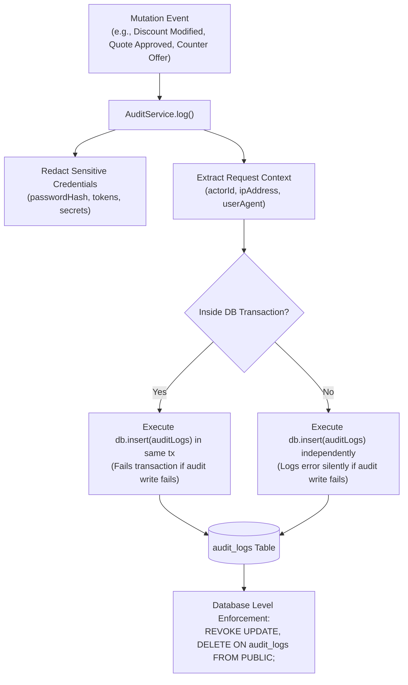
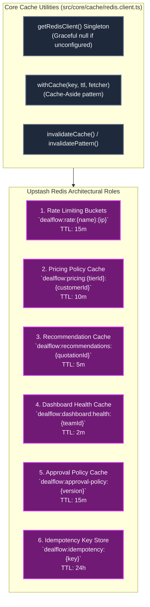
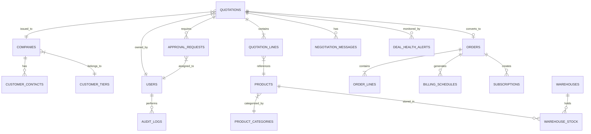

# DealFlow360 — System Architecture & Design Specification

## Document Purpose & Overview

This document defines the complete production architecture, data models, state machines, business engines, performance strategies, and security design for **DealFlow360** — an intelligent, self-governing B2B sales operations platform.

DealFlow360 is built as a **Modular Monolith** driven by PostgreSQL as the authoritative source of commercial truth and accelerated by Upstash Redis for caching, rate limiting, and idempotency.

---

## 1. Executive System Architecture

```mermaid
flowchart TB
    classDef client fill:#1e293b,stroke:#64748b,color:#f8fafc,stroke-width:2px;
    classDef gateway fill:#0f172a,stroke:#3b82f6,color:#f8fafc,stroke-width:2px;
    classDef engine fill:#1e1b4b,stroke:#6366f1,color:#f8fafc,stroke-width:2px;
    classDef storage fill:#064e3b,stroke:#10b981,color:#f8fafc,stroke-width:2px;
    classDef redis fill:#701a75,stroke:#d946ef,color:#f8fafc,stroke-width:2px;

    subgraph CLIENTS [" Client Layer "]
        web["React 18 Web App\n(Internal Workspace)"]:::client
        portal_ui["Restricted Customer Portal\n(Negotiation UI)"]:::client
    end

    subgraph GATEWAY [" API Gateway & Middleware Layer (Express + TypeScript) "]
        cors["CORS & Helmet"]:::gateway
        auth_mw["Dual Auth Middleware\n(Internal JWT / Portal Magic Links)"]:::gateway
        rbac_mw["RBAC & Resource Policy Guard"]:::gateway
        rate_mw["Redis Rate Limiter\n(express-rate-limit + rate-limit-redis)"]:::gateway
        idemp_mw["Idempotency Middleware\n(24h Replay Engine)"]:::gateway
        zod_mw["Zod Request Validator"]:::gateway
    end

    subgraph ENGINES [" Core Domain Engines & Business Logic "]
        quote_sm["Quotation State Machine\n(Draft -> Approval -> Fulfillment -> Order)"]:::engine
        disc_eng["Discount Governance Engine\n(Tier & Category Ceilings)"]:::engine
        risk_eng["Blended Risk Calculator\n(Excess + Margin + Category Weights)"]:::engine
        appr_eng["Approval Routing Engine\n(Persisted Policy Pipeline)"]:::engine
        rec_eng["Deterministic Recommendation Engine\n(Cart Upsell/Cross-sell Ranking)"]:::engine
        fulf_eng["Fulfillment & Inventory Engine\n(Atomic SQL Reservation)"]:::engine
        bill_eng["Hybrid Billing Engine\n(One-time Invoices & Subscriptions)"]:::engine
        health_eng["Deal Health Scanner Engine\n(Stalled & Anomaly Detectors)"]:::engine
        audit_svc["Immutable Audit Service\n(Append-Only + DB Revoke)"]:::engine
    end

    subgraph STORAGE [" Persistence & State Layer "]
        pg[("PostgreSQL 16\nAuthoritative Database\n(Drizzle ORM)")]:::storage
        redis[("Upstash Redis\nCache / Rate Limits / Idempotency\n(Non-Authoritative)")]:::redis
    end

    CLIENTS --> GATEWAY
    GATEWAY --> ENGINES
    ENGINES --> pg
    ENGINES <--> redis
```



---

## 2. Architectural Principles & System Boundaries

### 2.1 Correctness & Source of Truth
- **PostgreSQL is the single source of commercial truth.** Financial totals, quotation line calculations, margin calculations, inventory stock levels, approval states, and audit trails are computed on the backend and stored in PostgreSQL.
- **Do not trust client inputs.** Unit prices, tax rates, category ceilings, discounts, and margins supplied by frontends are rejected or re-calculated server-side.

### 2.2 Redis Non-Authoritative Cache Rule
- **Upstash Redis is strictly a read cache, rate-limit bucket, and idempotency store.**
- Redis failure or network degradation **must never corrupt business state or block transactions**. If Redis is offline, all cache utilities gracefully fall back to PostgreSQL queries transparently.

### 2.3 Strict Layering (Core Dependency Rule)
```text
HTTP Route -> Middleware -> Controller -> Application Service -> Domain Engine -> Repository -> Drizzle ORM -> PostgreSQL
```
- **No reverse dependencies**: Repositories never import Controllers; Domain Engines never depend on Express `req`/`res` objects or React states.

---

## 3. End-to-End Commercial Deal Lifecycle



---

## 4. Domain Engine Architecture

### 4.1 Quotation State Machine
The quotation lifecycle is governed by an explicit state machine enforcing legal status transitions:



---

### 4.2 Discount Governance & Blended Risk Engine

#### Business Rules
1. **Customer Tier Limits**: e.g., Gold = 15%, Silver = 10%, Bronze = 5%.
2. **Category Ceilings**: e.g., Hardware = 15%, Services = 10%, Subscriptions = 10%.
3. **Allowed Line Discount**:
   $$\text{allowedDiscount}_i = \min(\text{customerTierLimit}, \text{categoryLimit}_i)$$
4. **Line Discount Excess**:
   $$\text{lineExcess}_i = \max(0, \text{actualDiscount}_i - \text{allowedDiscount}_i)$$

#### Deterministic Blended Risk Model
The engine evaluates all lines and returns a weighted risk score:

$$\text{Risk Score} = \sum_{i=1}^{N} \left( \text{lineExcess}_i \times W_{\text{discount}} + \text{marginRisk}_i \times W_{\text{margin}} + \text{categoryRisk}_i \right)$$



---

### 4.3 Concurrency-Safe Inventory & Fulfillment Engine

To prevent overselling under concurrent requests, inventory reservations use **atomic SQL conditional updates**:

```sql
UPDATE warehouse_stock
SET available_qty = available_qty - $qty,
    reserved_qty  = reserved_qty + $qty
WHERE warehouse_id = $warehouseId
  AND product_id   = $productId
  AND available_qty >= $qty;
```

#### Multi-Warehouse Split Allocation Algorithm
Given required quantity $Q$ and candidate warehouses $W_1 \dots W_n$:
1. Select warehouses with $\text{available\_qty} > 0$ ordered by stock distance/capacity.
2. Find allocation $x_1 \dots x_n$ such that $\sum x_i = Q$ and $0 \le x_i \le \text{available\_qty}_i$.
3. Minimize:
   $$\text{Cost} = \alpha \times \text{shipmentCount} + \beta \times \text{shippingCost} + \gamma \times \text{splitPenalty}$$



---

### 4.4 Hybrid Order Billing & Subscription Proration Engine

An order splits quotation lines into one-time items and recurring subscription lines:



---

### 4.5 Deal Health & Anomaly Detection Engine

The `DealHealthEngine` scans open deals asynchronously in background jobs to detect stalled pipeline items and discount anomalies without blocking quotation creation.



---

### 4.6 Immutable Append-Only Audit Trail

To meet compliance requirements, sensitive application mutations emit audit logs.



---

## 5. Upstash Redis Cache, Rate Limiting & Idempotency Architecture

Redis is integrated across 6 distinct concerns with key namespacing and explicit TTLs:



### Redis Key Conventions & TTL Summary Table

| Concern | Key Convention | TTL | Invalidation Trigger |
| :--- | :--- | :--- | :--- |
| **Rate Limiting** | `dealflow:rate:{name}:{ip}` | 15 min | Automatic expiration |
| **Pricing Policy** | `dealflow:pricing:{tierId}:{customerId}` | 10 min | Discount policy mutation |
| **Recommendations** | `dealflow:recommendations:{quotationId}` | 5 min | Quotation line modification |
| **Dashboard Aggregates**| `dealflow:dashboard:health:{teamId}` | 2 min | Health alert escalation / resolution |
| **Approval Policy** | `dealflow:approval-policy:{version}` | 15 min | Approval rule creation / update |
| **Idempotency Keys** | `dealflow:idempotency:{key}` | 24 hours | Automatic expiration |

---

## 6. Database Entity-Relationship & Schema Design



---

## 7. PostgreSQL Indexing & Query Optimization

Indexes are built strictly around real access patterns identified in business workflows:

```sql
-- 1. User Email Lookup (Auth Pipeline)
CREATE UNIQUE INDEX IF NOT EXISTS ux_users_email ON users(email);

-- 2. Quotation Owner & Status (Sales Rep Dashboard)
CREATE INDEX IF NOT EXISTS ix_quotations_owner_status ON quotations(owner_id, status);

-- 3. Pipeline Review (Filter by Status & Order by Date)
CREATE INDEX IF NOT EXISTS ix_quotations_status_created ON quotations(status, created_at DESC);

-- 4. Approval Queue Partial Index (Only Pending Approvals)
CREATE INDEX IF NOT EXISTS ix_quotations_status_risk ON quotations(status, risk_score DESC)
WHERE status = 'PENDING_APPROVAL';

-- 5. Quotation Lines & Product Joins
CREATE INDEX IF NOT EXISTS ix_quote_lines_quotation ON quotation_lines(quotation_id);
CREATE INDEX IF NOT EXISTS ix_quote_lines_product ON quotation_lines(product_id);

-- 6. Warehouse Stock Allocation Lookup
CREATE INDEX IF NOT EXISTS ix_stock_product_available ON warehouse_stock(product_id, available_qty DESC);

-- 7. Billing Worker Partial Index (Due Scheduled Invoices)
CREATE INDEX IF NOT EXISTS ix_billing_due ON billing_schedules(billing_date)
WHERE status = 'SCHEDULED';

-- 8. Customer Portal Quotation Lookup
CREATE INDEX IF NOT EXISTS ix_quotations_customer_created ON quotations(customer_id, created_at DESC);

-- 9. Open Health Alerts Partial Index
CREATE INDEX IF NOT EXISTS ix_health_open ON deal_health_alerts(severity, created_at DESC)
WHERE unresolved = true;
```

---

## 8. Complete Repository Code & Module Mapping

```text
dealflow360/
├── server/
│   ├── src/
│   │   ├── config/
│   │   │   └── index.ts                 # Zod environment variables loader
│   │   ├── core/
│   │   │   ├── audit/
│   │   │   │   ├── audit.service.ts     # Central AuditService (log, fromRequest, redaction)
│   │   │   │   └── audit.types.ts       # Action constants & Entity types
│   │   │   ├── authz/
│   │   │   │   ├── helpers.ts           # Permission check guards
│   │   │   │   └── policies/            # Quotation, Customer, Product policies
│   │   │   ├── cache/
│   │   │   │   ├── cache.keys.ts        # Typed key builders & TTL registry
│   │   │   │   └── redis.client.ts      # Upstash Redis singleton & withCache helper
│   │   │   ├── errors/
│   │   │   │   └── AppError.ts          # Central error classes (Unauthorized, Forbidden, etc.)
│   │   │   ├── middleware/
│   │   │   │   ├── authenticate.ts      # Internal JWT verification middleware
│   │   │   │   ├── authenticatePortal.ts# Customer magic link auth middleware
│   │   │   │   ├── errorHandler.ts      # Central Express error handling middleware
│   │   │   │   ├── idempotency.ts       # Redis-backed HTTP idempotency replay middleware
│   │   │   │   └── rateLimiter.ts       # Redis-backed rate limiting middleware factory
│   │   │   └── transformers/
│   │   │       └── portalDataHiding.ts  # Redacts margin, risk, & internal notes for portal
│   │   ├── db/
│   │   │   ├── client.ts                # Drizzle ORM PostgreSQL connection client
│   │   │   └── schema/
│   │   │       └── dealflow.ts          # Complete Drizzle schema definition
│   │   ├── modules/
│   │   │   ├── approvalRules/           # Approval rules management module
│   │   │   ├── approvals/               # ApprovalRoutingEngine & workflow execution
│   │   │   ├── auth/                    # Internal authentication module
│   │   │   ├── billing/                 # OrderService, BillingEngine, SubscriptionService
│   │   │   ├── customers/               # Customer & Contact management module
│   │   │   ├── dealHealth/              # DealHealthEngine & alert scanner module
│   │   │   ├── discounts/               # DiscountEngine & DiscountPolicyRepository
│   │   │   ├── fulfillment/             # InventoryService & FulfillmentEngine
│   │   │   ├── portal/                  # Restricted Customer Portal module
│   │   │   ├── portalAuth/              # Customer magic link authentication module
│   │   │   ├── pricing/                 # Pricing management module
│   │   │   ├── products/                # Catalog management module
│   │   │   ├── quotations/              # Quotation aggregate & State Machine module
│   │   │   └── recommendations/         # Deterministic RecommendationEngine module
│   │   ├── routes/
│   │   │   └── index.ts                 # Aggregated Express API routes (/api/v1)
│   │   └── server.ts                    # HTTP server entrypoint
│   ├── migrations/
│   │   └── audit_revoke.sql             # SQL script revoking DELETE/UPDATE on audit_logs
│   └── tests/                           # Complete Jest integration & unit test suite
```

---

## 9. Definition of Done & Quality Checklist

- [x] **Database Schema**: Fully defined using Drizzle ORM in `server/src/db/schema/dealflow.ts`.
- [x] **Append-Only Audit**: DB-level privileges revoked via `migrations/audit_revoke.sql` and `AuditService` implemented.
- [x] **Redis Integration**: Upstash Redis client with graceful memory fallback, key builders, rate limiters, and idempotency middleware created.
- [x] **Quotation State Machine**: Legal transitions enforced in `quotations.state-machine.ts`.
- [x] **Discount Governance Engine**: Tier limits, category ceilings, and blended risk model implemented.
- [x] **Approval Routing Engine**: Driven by persisted approval rules with policy caching.
- [x] **Fulfillment Engine**: Concurrency-safe atomic SQL inventory reservation implemented.
- [x] **Hybrid Billing**: Orders, recurring schedules, subscriptions, and proration calculations built.
- [x] **Customer Portal**: Restricted access with internal margin and risk data-hiding transformers.
- [x] **Deal Health**: Stalled deals scan & anomaly detection implemented with caching.
- [x] **Automated Tests**: Unit & integration test suite written and verified with Jest.
